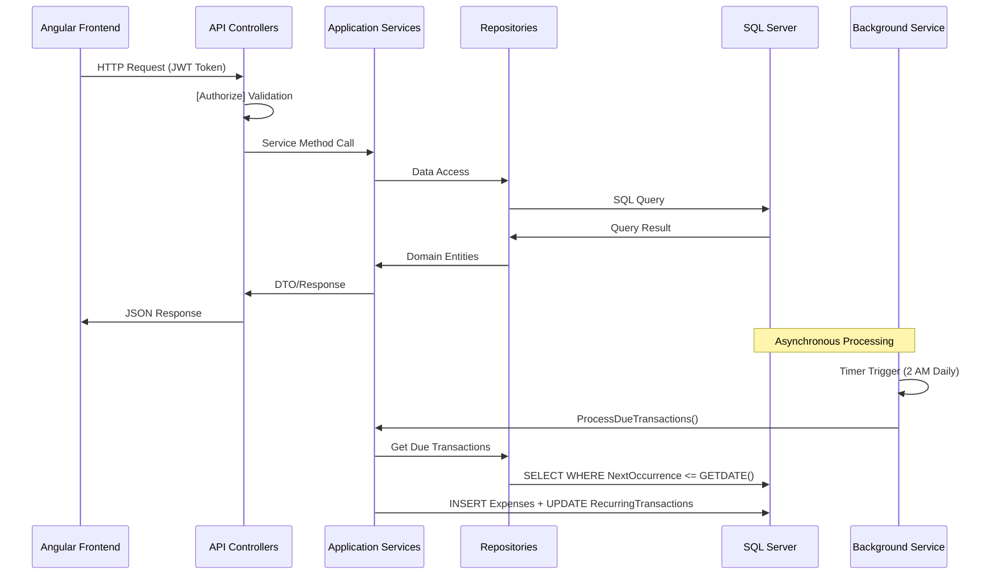
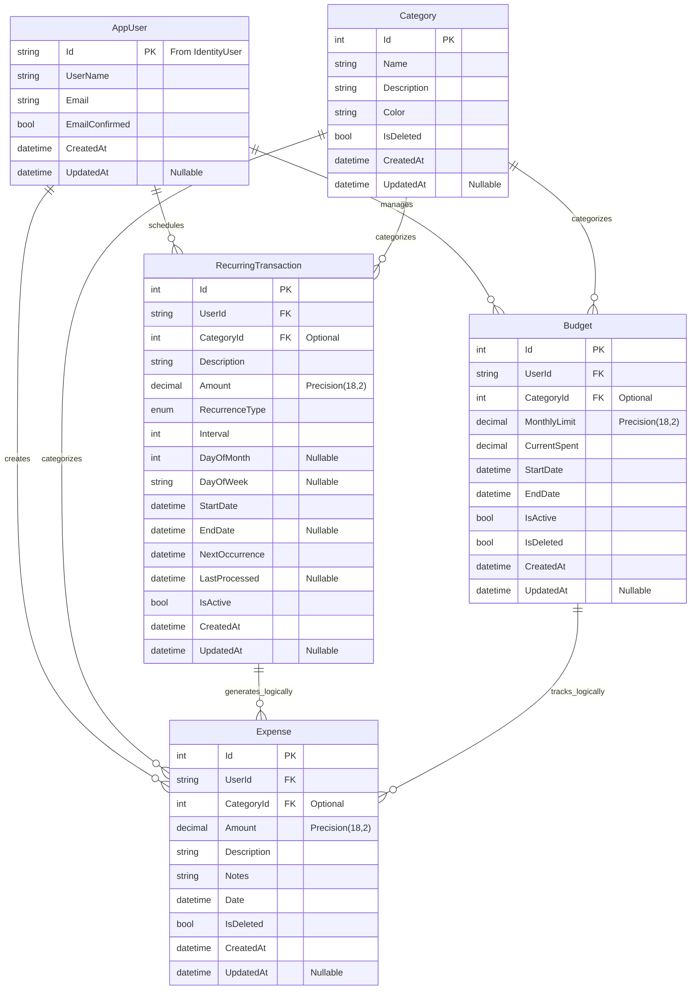

# 🚀 **MoneyPilot Backend - Complete Documentation**

## 📋 **Project Overview**

**MoneyPilot** is a full-stack personal finance management application built with **ASP.NET Core 8 (Backend)** and **Angular 17 (Frontend)**. The backend implements Clean Architecture principles, providing a scalable, maintainable, and secure API for financial tracking.

### **🎯 Core Purpose**
- Personal expense and income tracking
- Budget planning and monitoring
- Recurring transaction automation
- Investment tracking simulation
- Financial habit building

### **📊 Project Status**
| Phase | Status | Completion |
|-------|--------|------------|
| Phase 1: Foundation | ✅ Complete | 100% |
| Phase 2: Recurring Transactions | ✅ Complete | 100% |
| Phase 3: Background Service | ✅ Complete | 100% |
| Phase 4: Angular Frontend | 🚧 In Progress | 0% |
| Phase 5: Deployment | 📅 Planned | 0% |

---

## 🏗️ **Technology Stack**

### **Backend (.NET 8)**
```yaml
Framework: ASP.NET Core 8.0
Language: C# 11
Architecture: Clean Architecture (Onion)
ORM: Entity Framework Core 8
Database: SQL Server 2022
Authentication: JWT + ASP.NET Identity
Logging: Serilog (Console + File)
Health Checks: AspNetCore.HealthChecks
API Documentation: Swagger/OpenAPI 3.0
```

### **DevOps & Tooling**
```yaml
Version Control: Git + GitHub
CI/CD: GitHub Actions (Planned)
Containerization: Docker (Planned)
Hosting: Azure App Service (Planned)
Monitoring: Application Insights (Planned)
Testing: xUnit, Moq, TestServer
```

---

## 🏛️ **System Architecture**

### **Clean Architecture Layers**

```
┌─────────────────────────────────────┐
│         Frontend (Angular 17)       │
└─────────────────┬───────────────────┘
                  ↓ HTTP/HTTPS
┌─────────────────────────────────────┐
│     API Layer (MoneyPilot.API)      │
│  • Controllers                       │
│  • Middleware (JWT, Logging)        │
│  • Program.cs Configuration         │
└─────────────────┬───────────────────┘
                  ↓ Dependency Injection
┌─────────────────────────────────────┐
│ Application Layer (MoneyPilot.App)  │
│  • DTOs (Data Transfer Objects)     │
│  • Service Interfaces               │
│  • Business Logic Contracts         │
└─────────────────┬───────────────────┘
                  ↓ Interface Implementation
┌─────────────────────────────────────┐
│ Infrastructure (MoneyPilot.Infra)   │
│  • Entity Framework Context         │
│  • Repository Implementations       │
│  • External Service Integrations    │
│  • Background Services              │
└─────────────────┬───────────────────┘
                  ↓ Data Access
┌─────────────────────────────────────┐
│    Domain Layer (MoneyPilot.Domain) │
│  • Core Business Entities           │
│  • Value Objects                    │
│  • Domain Events                    │
│  • Business Rules                   │
└─────────────────┬───────────────────┘
                  ↓ ORM Mapping
┌─────────────────────────────────────┐
│          SQL Server Database        │
│  • Code-First Migrations            │
│  • Stored Procedures (Optional)     │
└─────────────────────────────────────┘
```

### **Request Flow**


---

## 📁 **Project Structure**

```
MoneyPilot/
│
├── MoneyPilot.API/                         # Presentation Layer (API)
│   ├── Controllers/                        # REST API Controllers
│   │   ├── AuthController.cs
│   │   ├── ExpensesController.cs
│   │   ├── BudgetController.cs
│   │   ├── CategoriesController.cs
│   │   ├── RecurringTransactionsController.cs
│   │   └── DashboardController.cs
│   │
│   ├── Middleware/                         # Custom Middleware
│   │   ├── ExceptionHandlingMiddleware.cs
│   │   └── SecurityHeadersMiddleware.cs
│   │
│   ├── Extensions/                         # API Extensions
│   │   ├── SwaggerExtensions.cs
│   │   ├── HealthEndpointExtensions.cs
│   │   └── DiagnosticEndpointExtensions.cs
│   │
│   ├── Properties/
│   │   └── launchSettings.json
│   │
│   ├── Program.cs                          # Application Startup & Pipeline
│   ├── appsettings.json                    # Production Configuration
│   └── appsettings.Development.json        # Dev Overrides
│
│
├── MoneyPilot.Application/                 # Application Layer
│   ├── DTOs/                               # Data Transfer Objects
│   │   ├── Auth/
│   │   │   ├── LoginDto.cs
│   │   │   └── RegisterDto.cs
│   │   │
│   │   ├── Category/
│   │   │   ├── CategoryDto.cs
│   │   │   └── CreateCategoryDto.cs
│   │   │
│   │   ├── Expense/
│   │   │   ├── ExpenseDto.cs
│   │   │   └── CreateExpenseDto.cs
│   │   │
│   │   ├── Budget/
│   │   │   ├── BudgetDto.cs
│   │   │   └── CreateBudgetDto.cs
│   │   │
│   │   ├── RecurringTransaction/
│   │   │   ├── RecurringTransactionDto.cs
│   │   │   ├── CreateRecurringTransactionDto.cs
│   │   │   ├── UpdateRecurringTransactionDto.cs
│   │   │   └── RecurringTransactionProcessingResultDto.cs
│   │   │
│   │   ├── DashboardSummaryDto.cs
│   │   ├── ApiResponse.cs
│   │   └── PagedResponse.cs
│   │
│   ├── Interfaces/                         # Service Contracts
│   │   ├── IExpenseService.cs
│   │   ├── IBudgetService.cs
│   │   ├── ICategoryService.cs
│   │   ├── IRecurringTransactionService.cs
│   │   ├── IDashboardService.cs
│   │   ├── IRepository.cs
│   │   └── IUnitOfWork.cs
│   │
│   └── Configs/
│       └── RecurringTransactionConfig.cs
│
│
├── MoneyPilot.Domain/                      # Core Business Layer
│   ├── Entities/
│   │   ├── AppUser.cs
│   │   ├── Expense.cs
│   │   ├── Budget.cs
│   │   ├── Category.cs
│   │   └── RecurringTransaction.cs
│   │
│   ├── Enums/
│   │   └── RecurrenceType.cs
│   │
│   └── Common/
│       └── BaseAuditableEntity.cs
│
│
├── MoneyPilot.Infrastructure/              # Infrastructure Layer
│   ├── Data/
│   │   ├── MoneyPilotDbContext.cs
│   │   └── DesignTimeDbContextFactory.cs
│   │
│   ├── Migrations/
│   │   └── <MigrationFiles>
│   │
│   ├── Repositories/
│   │   ├── Repository.cs
│   │   ├── ExpenseRepository.cs
│   │   ├── BudgetRepository.cs
│   │   └── UnitOfWork.cs
│   │
│   ├── Services/
│   │   ├── ExpenseService.cs
│   │   ├── BudgetService.cs
│   │   ├── CategoryService.cs
│   │   ├── DashboardService.cs
│   │   ├── RecurringTransactionService.cs
│   │   └── RecurringTransactionBackgroundService.cs
│   │
│   ├── Logging/
│   │   └── SerilogExtensions.cs
│   │
│   └── Extensions/
│       └── ServiceExtensions.cs
│
│
└── MoneyPilot.Tests/                       # Testing Layer
    ├── UnitTests/
    │   ├── ExpenseServiceTests.cs
    │   ├── BudgetServiceTests.cs
    │   └── RecurringTransactionServiceTests.cs
    │
    ├── IntegrationTests/
    │   ├── ExpenseControllerTests.cs
    │   └── AuthControllerTests.cs
    │
    └── TestHelpers/
        └── MockDataFactory.cs

```

---

## 🗄️ **Database Design**

### **Entity Relationship Diagram**



### **Key Tables & Relationships**

1. **AppUser** (extends IdentityUser)
   - One-to-Many with Expenses, Budgets, RecurringTransactions
   - Authentication via ASP.NET Identity

2. **Expense**
   - Foreign Keys: UserId, CategoryId
   - Auditable: CreatedAt, UpdatedAt

3. **RecurringTransaction**
   - Enum: RecurrenceType (Daily, Weekly, Monthly, Yearly)
   - Calculated: NextOccurrence (automatically updated)
   - One-to-Many: Generates Expenses

4. **Budget**
   - Time-bound: StartDate, EndDate
   - Calculated: CurrentSpent (aggregated from Expenses)

5. **Category**
   - Hierarchical support (optional)
   - Color coding for UI visualization

---

## 🔌 **API Endpoints**

### **Base URL**: `https://money-pilot-webapi.onrender.com`

### **📊 Authentication Endpoints**

| Method | Endpoint | Description | Auth Required |
|--------|----------|-------------|---------------|
| `POST` | `/api/auth/register` | Register new user | No |
| `POST` | `/api/auth/login` | Login and get JWT token | No |
| `POST` | `/api/auth/refresh` | Refresh JWT token | Yes |
| `POST` | `/api/auth/logout` | Logout and invalidate token | Yes |

**Example Request:**
```http
POST /api/auth/login
Content-Type: application/json

{
  "email": "test@email.com",
  "password": "Test@123"
}

Response:
{
  "token": "eyJhbGciOiJIUzI1NiIs...",
  "expires": "2024-02-17T14:45:24Z",
  "user": {
    "id": "guid",
    "email": "test@email.com",
    "roles": ["User"]
  }
}
```

### **💰 Expense Management**

| Method | Endpoint | Description | Query Parameters |
|--------|----------|-------------|------------------|
| `GET` | `/api/expenses` | Get user expenses | `page`, `pageSize`, `startDate`, `endDate`, `categoryId` |
| `GET` | `/api/expenses/{id}` | Get specific expense | - |
| `POST` | `/api/expenses` | Create new expense | - |
| `PUT` | `/api/expenses/{id}` | Update expense | - |
| `DELETE` | `/api/expenses/{id}` | Delete expense | - |
| `GET` | `/api/expenses/summary` | Get expense summary | `period` (daily, weekly, monthly) |

**Example:**
```http
GET /api/expenses?page=1&pageSize=20&startDate=2024-02-01
Authorization: Bearer {token}

Response:
{
  "items": [
    {
      "id": 1,
      "amount": 29.99,
      "description": "Groceries",
      "category": "Food",
      "date": "2024-02-15"
    }
  ],
  "totalCount": 45,
  "page": 1,
  "pageSize": 20
}
```

### **📈 Budget Management**

| Method | Endpoint | Description |
|--------|----------|-------------|
| `GET` | `/api/budgets` | Get user budgets |
| `GET` | `/api/budgets/{id}` | Get specific budget |
| `POST` | `/api/budgets` | Create budget |
| `PUT` | `/api/budgets/{id}` | Update budget |
| `DELETE` | `/api/budgets/{id}` | Delete budget |
| `GET` | `/api/budgets/current` | Get current active budgets |

### **🔄 Recurring Transactions**

| Method | Endpoint | Description |
|--------|----------|-------------|
| `GET` | `/api/recurring-transactions` | Get all recurring transactions |
| `GET` | `/api/recurring-transactions/{id}` | Get specific transaction |
| `POST` | `/api/recurring-transactions` | Create recurring transaction |
| `PUT` | `/api/recurring-transactions/{id}` | Update transaction |
| `DELETE` | `/api/recurring-transactions/{id}` | Delete transaction |
| `GET` | `/api/recurring-transactions/due` | Get due transactions |
| `POST` | `/api/recurring-transactions/process-due` | Manually process due transactions |

### **🎯 Background Service Monitoring**

| Method | Endpoint | Description | Auth Required |
|--------|----------|-------------|---------------|
| `GET` | `/health` | Overall health check | No |
| `GET` | `/health/background-service` | Background service status | No |
| `POST` | `/admin/background-service/trigger` | Manual trigger | Yes (Admin) |
| `GET` | `/admin/background-service` | Service configuration | Yes (Admin) |

### **🛠️ Development & Testing Endpoints**

| Method | Endpoint | Description |
|--------|----------|-------------|
| `GET` | `/auto-login-simple` | Auto-login HTML page |
| `GET` | `/generate-token` | Generate test token |
| `GET` | `/test-user` | Check test user |
| `GET` | `/swagger` | API documentation |
| `GET` | `/diagnostics/startup` | Startup diagnostics |
| `GET` | `/api/logs/recent` | View recent logs |
| `POST` | `/seed` | Seed test data |
| `GET` | `/test-db` | Database connectivity test |

---

## 🔐 **Authentication & Security**

### **JWT Implementation**
```csharp
// JWT Configuration in appsettings.json
"Jwt": {
  "Key": "ThisIsYourSuperSecureKeyDontUseInProd",
  "Issuer": "MoneyPilotAPI",
  "Audience": "MoneyPilotUsers",
  "ExpiresInMinutes": 60
}
```

### **Security Features**
1. **JWT Bearer Tokens**: 60-minute expiry with refresh capability
2. **Password Hashing**: ASP.NET Identity PasswordHasher (PBKDF2)
3. **CORS Policy**: Configured for local development
4. **HTTPS Redirection**: Enforced in production
5. **Role-based Authorization**: [Authorize(Roles = "Admin")]
6. **Input Validation**: FluentValidation on all DTOs
7. **SQL Injection Prevention**: Entity Framework parameterized queries
8. **XSS Protection**: Content Security Policy headers

### **Authorization Example:**
```csharp
[Authorize]
public class ExpensesController : ControllerBase
{
    [HttpGet]
    [Authorize(Roles = "User,Admin")]
    public async Task<IActionResult> GetExpenses() { }
    
    [HttpPost]
    [Authorize(Roles = "Admin")]
    public async Task<IActionResult> CreateExpense() { }
}
```

---

## ⚙️ **Background Service**

### **RecurringTransactionBackgroundService**
- **Type**: `IHostedService` (BackgroundService)
- **Schedule**: Daily at 2:00 AM (configurable)
- **Retry Logic**: 3 attempts with 60-second delays
- **Scope Management**: Uses `IServiceScopeFactory` for DbContext isolation

### **Configuration:**
```json
"RecurringTransactionProcessing": {
  "Enabled": true,
  "ProcessingTime": "02:00:00",
  "RetryCount": 3,
  "RetryDelaySeconds": 60,
  "RunOnStartup": true
}
```

### **Processing Logic:**
1. Query recurring transactions where `NextOccurrence <= Today`
2. For each transaction:
   - Create Expense record
   - Calculate next occurrence based on recurrence pattern
   - Update `LastProcessed` timestamp
3. Commit changes in transaction
4. Log processing results

### **Monitoring:**
```bash
# Check service status
curl https://money-pilot-webapi.onrender.com/health/background-service

# Manual trigger
curl -X POST https://money-pilot-webapi.onrender.com/admin/background-service/trigger

# View logs
curl https://money-pilot-webapi.onrender.com/api/logs/recent
```

---

## 📊 **Logging & Monitoring**

### **Serilog Configuration**
```csharp
Log.Logger = new LoggerConfiguration()
    .MinimumLevel.Information()
    .MinimumLevel.Override("Microsoft", LogEventLevel.Warning)
    .Enrich.FromLogContext()
    .WriteTo.Console(outputTemplate: "[{Timestamp:HH:mm:ss} {Level:u3}] {Message:lj}{NewLine}{Exception}")
    .WriteTo.File("Logs/moneypilot_api_log.txt",
        rollingInterval: RollingInterval.Day,
        retainedFileCountLimit: 7,
        outputTemplate: "{Timestamp:yyyy-MM-dd HH:mm:ss.fff zzz} [{Level:u3}] {Message:lj}{NewLine}{Exception}")
    .CreateLogger();
```

### **Log Levels**
- **Information**: Service startup, background processing
- **Warning**: Non-critical errors, validation failures
- **Error**: Application exceptions, database errors
- **Critical**: System failures, unrecoverable errors

### **Health Checks**
```csharp
// Health check endpoints
app.MapHealthChecks("/health", new HealthCheckOptions
{
    ResponseWriter = UIResponseWriter.WriteHealthCheckUIResponse
});

// Database health check
services.AddHealthChecks()
    .AddDbContextCheck<MoneyPilotDbContext>()
    .AddSqlServer(connectionString);
```

---

## 🧪 **Testing Strategy**

### **Test Categories**
1. **Unit Tests** (xUnit): Service logic, business rules
2. **Integration Tests**: API endpoints, database operations
3. **Component Tests**: Full feature testing
4. **Performance Tests**: Load testing for background service

### **Test Structure**
```
MoneyPilot.Tests/
├── UnitTests/
│   ├── Services/
│   │   ├── ExpenseServiceTests.cs
│   │   └── RecurringTransactionServiceTests.cs
│   └── Validators/
│       └── CreateExpenseDtoValidatorTests.cs
├── IntegrationTests/
│   ├── Controllers/
│   │   ├── ExpensesControllerTests.cs
│   │   └── AuthControllerTests.cs
│   └── Repositories/
│       └── ExpenseRepositoryTests.cs
└── TestHelpers/
    ├── TestDataFactory.cs
    └── DatabaseFixture.cs
```

### **Test Coverage Goals**
- Services: 80%+
- Controllers: 70%+
- Complex business logic: 90%+
- Overall: 75%+

---

## 🚀 **Setup & Deployment**

### **Local Development Setup**

```bash
# 1. Clone repository
git clone https://github.com/coder-pro10z/money-pilot.git
cd money-pilot

# 2. Install dependencies
dotnet restore

# 3. Update connection string in appsettings.json
"ConnectionStrings": {
  "DefaultConnection": "Server=localhost;Database=MoneyPilotDb;Integrated Security=True;TrustServerCertificate=True"
}

# 4. Run database migrations
cd src/MoneyPilot.API
dotnet ef database update

# 5. Run the application
dotnet run

# 6. Access endpoints
# API: https://localhost:44391
# Swagger: https://localhost:44391/swagger
# Auto-login: https://localhost:44391/auto-login-simple
```

### **Environment Configuration**

| Environment | Configuration File | Database | Logging |
|-------------|-------------------|----------|---------|
| Development | `appsettings.Development.json` | LocalDB | Console + File |
| Staging | `appsettings.Staging.json` | Azure SQL | Azure App Insights |
| Production | `appsettings.Production.json` | Azure SQL | Azure App Insights |

### **Docker Deployment**
```dockerfile
# Dockerfile
FROM mcr.microsoft.com/dotnet/aspnet:8.0 AS base
WORKDIR /app
EXPOSE 80
EXPOSE 443

FROM mcr.microsoft.com/dotnet/sdk:8.0 AS build
WORKDIR /src
COPY ["MoneyPilot.API/MoneyPilot.API.csproj", "MoneyPilot.API/"]
RUN dotnet restore "MoneyPilot.API/MoneyPilot.API.csproj"
COPY . .
RUN dotnet build "MoneyPilot.API/MoneyPilot.API.csproj" -c Release -o /app/build

FROM build AS publish
RUN dotnet publish "MoneyPilot.API/MoneyPilot.API.csproj" -c Release -o /app/publish

FROM base AS final
WORKDIR /app
COPY --from=publish /app/publish .
ENTRYPOINT ["dotnet", "MoneyPilot.API.dll"]
```

### **Azure Deployment Checklist**
1. ✅ Create Azure App Service
2. ✅ Provision Azure SQL Database
3. ✅ Configure Application Insights
4. ✅ Set up Key Vault for secrets
5. ✅ Configure CI/CD pipeline
6. ✅ Set up custom domain
7. ✅ Configure SSL certificate
8. ✅ Set up backup strategy

---

## 📈 **Performance Optimization**

### **Database Optimization**
```sql
-- Indexes for common queries
CREATE INDEX IX_Expenses_UserId_Date 
ON Expenses(UserId, Date DESC);

CREATE INDEX IX_RecurringTransactions_NextOccurrence 
ON RecurringTransactions(NextOccurrence) 
WHERE IsActive = 1;

-- Partitioning strategy for Expenses table
CREATE PARTITION FUNCTION pf_ExpensesByMonth (datetime2)
AS RANGE RIGHT FOR VALUES (
    '2024-01-01', '2024-02-01', '2024-03-01'
);
```

### **Caching Strategy**
```csharp
// Response caching for static data
[HttpGet("categories")]
[ResponseCache(Duration = 3600)] // 1 hour cache
public async Task<IActionResult> GetCategories() { }

// Memory caching for frequent queries
services.AddMemoryCache();

// Redis for distributed caching (production)
services.AddStackExchangeRedisCache(options =>
{
    options.Configuration = Configuration.GetConnectionString("Redis");
});
```

### **API Performance Metrics**
| Endpoint | Target Response Time | Concurrent Users |
|----------|---------------------|------------------|
| GET /api/expenses | < 200ms | 1000 |
| POST /api/expenses | < 300ms | 500 |
| Background Processing | < 30 seconds | N/A |
| Health Checks | < 50ms | Unlimited |

---

## 🔧 **Troubleshooting Guide**

### **Common Issues & Solutions**

1. **Database Connection Failed**
   ```bash
   # Check SQL Server is running
   Get-Service MSSQLSERVER
   
   # Verify connection string
   Server=DESKTOP-48C94E6\\SQLEXPRESS;Database=MoneyPilotDb;Integrated Security=True;TrustServerCertificate=True
   ```

2. **Background Service Not Running**
   ```bash
   # Check logs
   Get-Content Logs/moneypilot_api_log.txt | Select-String "background"
   
   # Verify configuration
   curl https://localhost:44391/health/background-service
   ```

3. **JWT Token Issues**
   ```bash
   # Generate new token
   curl https://localhost:44391/generate-token
   
   # Test token validity
   curl -H "Authorization: Bearer {token}" https://localhost:44391/api/expenses
   ```

4. **Migration Errors**
   ```bash
   # Remove old migrations
   Remove-Item src/MoneyPilot.Infrastructure/Migrations/* -Force
   
   # Recreate migrations
   dotnet ef migrations add Initial
   dotnet ef database update
   ```

### **Monitoring Commands**
```powershell
# Check application logs
Get-Content Logs/moneypilot_api_log.txt -Tail 50 -Wait

# Monitor background service
while($true) { 
    curl https://localhost:44391/health/background-service; 
    Start-Sleep -Seconds 10 
}

# Database monitoring
sqlcmd -S DESKTOP-48C94E6\SQLEXPRESS -d MoneyPilotDb -Q "SELECT COUNT(*) FROM Expenses"
```

---

## 📚 **API Documentation Access**

### **Swagger UI**
- URL: `https://localhost:44391/swagger`
- Features: Interactive API testing, Model schemas, Authentication testing

### **OpenAPI Specification**
- URL: `https://localhost:44391/swagger/v1/swagger.json`
- Import into: Postman, Insomnia, or other API clients

### **Auto-Login for Testing**
- URL: `https://localhost:44391/auto-login-simple`
- Generates: Test JWT token with one click
- Test User: `test@email.com` / `Test@123`

---

## 🎯 **Key Features Implemented**

### **✅ Completed Features**
1. **Clean Architecture Implementation** - Proper separation of concerns
2. **JWT Authentication** - Secure API access with role-based authorization
3. **CRUD Operations** - Full expense, budget, and category management
4. **Recurring Transactions** - Automated expense generation with scheduling
5. **Background Service** - Automated daily processing with retry logic
6. **Health Monitoring** - System health checks and diagnostics
7. **Structured Logging** - Serilog with file and console outputs
8. **Database Migrations** - EF Core code-first migrations
9. **API Documentation** - Swagger/OpenAPI 3.0
10. **Test Infrastructure** - xUnit test projects

### **🚧 In Progress**
1. **Angular Frontend** - User interface development
2. **Advanced Reporting** - Analytics and insights
3. **Real-time Updates** - SignalR integration

### **📅 Planned Features**
1. **Investment Tracking** - Portfolio management
2. **Habit Tracking** - Financial habit building
3. **Multi-tenancy** - Organization/team support
4. **Mobile App** - React Native/Xamarin
5. **Advanced Analytics** - Machine learning insights

---

## 🔗 **Useful Links**

### **Development**
- **GitHub Repository**: https://github.com/coder-pro10z/money-pilot
- **API Documentation**: https://money-pilot-webapi.onrender.com/swagger
- **Health Dashboard**: https://money-pilot-webapi.onrender.com/diagnostics/startup
- **Admin Dashboard**: https://money-pilot-webapi.onrender.com/admin/dashboard

### **Tools**
- **SQL Server Management Studio**: Connect to `DESKTOP-48C94E6\SQLEXPRESS`
- **Postman Collection**: Import from Swagger JSON
- **Serilog Viewer**: Analyze log files with `logviewer` tool

### **Next Steps**
1. Complete Angular frontend integration
2. Implement SignalR for real-time notifications
3. Add comprehensive unit test coverage
4. Deploy to Azure cloud infrastructure
5. Set up CI/CD pipeline with GitHub Actions

---

## 📞 **Support & Contact**

### **Project Maintainer**
- **Name**: Praveen Kashyap
- **GitHub**: @coder-pro10z
- **Role**: Full-stack developer & architect

### **Issue Reporting**
1. Check existing issues on GitHub
2. Review troubleshooting guide above
3. Provide logs and error details
4. Use GitHub Issues for bug reports

### **Contribution Guidelines**
1. Fork the repository
2. Create feature branch
3. Follow coding standards
4. Add unit tests
5. Submit pull request

---

**Documentation Version**: 1.0.0  
**Last Updated**: February 2026 
**Backend Version**: ASP.NET Core 8.0  
**Database**: SQL Server 2022  
**Status**: Production-Ready
