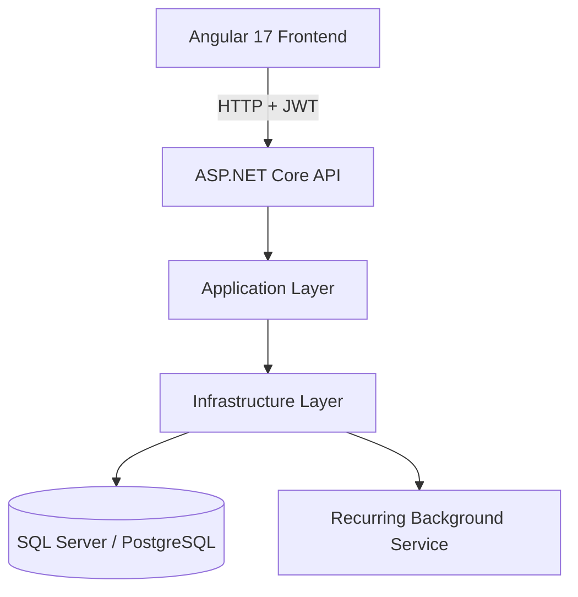
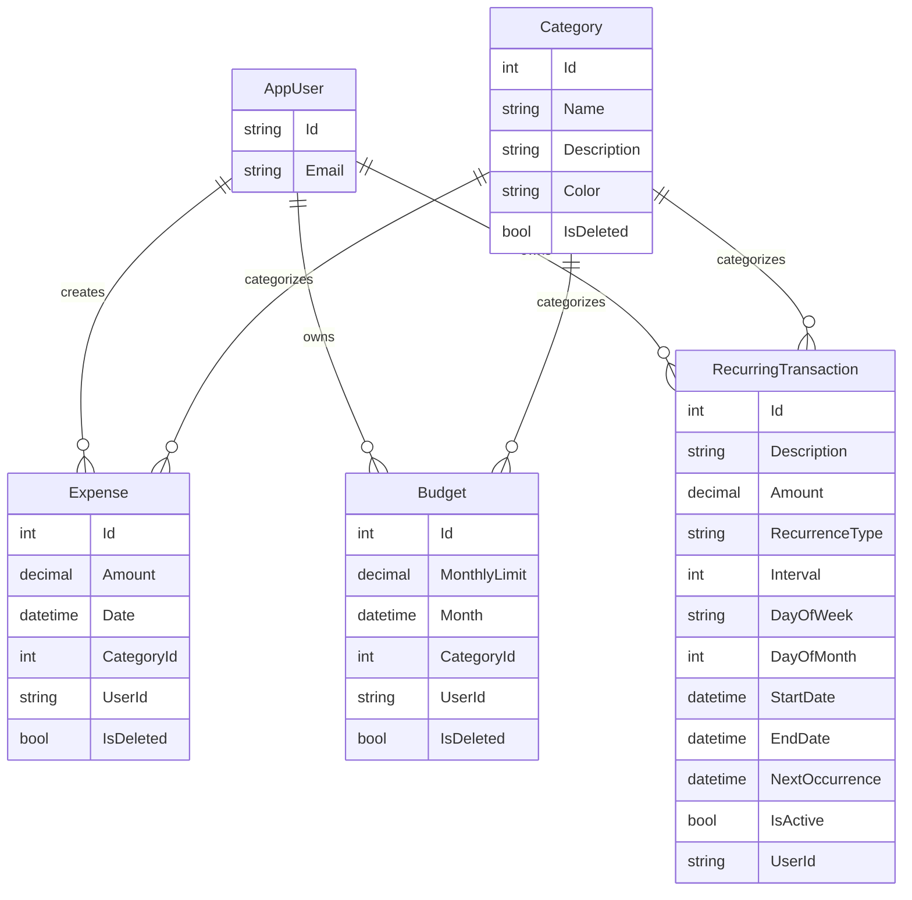

# MoneyPilot
[](https://github.com/coder-pro10z/money-pilot/releases)
[](https://dotnet.microsoft.com/)
[](https://angular.io/)
[]()
[](https://money-pilot-webapi.onrender.com/swagger)
[]()

MoneyPilot is a portfolio-ready full-stack personal finance management system built with ASP.NET Core 8 and Angular 17. It focuses on expense tracking, budget management, recurring transaction automation, and dashboard analytics while demonstrating clean architecture, typed contracts, secure JWT authentication, and production deployment.

## Live Links

| Service | URL |
|---|---|
| Frontend | `https://money-pilot-opal.vercel.app` |
| Backend API | `https://money-pilot-webapi.onrender.com` |
| Swagger | `https://money-pilot-webapi.onrender.com/swagger` |

## What The Application Does

MoneyPilot currently supports:

- User registration and login with JWT authentication
- Category management
- Expense CRUD with pagination and filtering
- Budget CRUD with dashboard integration
- Recurring transaction CRUD with automated background processing
- Dashboard summaries, category breakdowns, and monthly trends
- Health, diagnostics, and logging support endpoints
- Responsive Angular UI with standalone components and shared UX primitives

## System Design

At a high level, the system is a browser SPA that calls a secure REST API. The API delegates business use cases into application services, which coordinate repository access and persistence through EF Core.



### Request Flow

1. The Angular client calls a protected endpoint with a bearer token.
2. The API layer authenticates and authorizes the request.
3. Controllers act as a thin HTTP layer and delegate to application services.
4. Application services run business logic and orchestrate repositories.
5. Infrastructure persists data through `MoneyPilotDbContext`.
6. The API returns DTOs through standard response contracts.

## Clean Architecture

The backend follows a layered clean architecture split into Domain, Application, Infrastructure, and API.

### Domain

The Domain layer contains the core entities and rules of the finance system. It does not depend on web, database, or infrastructure concerns.

Current domain entities:

- `AppUser`
- `Category`
- `Expense`
- `Budget`
- `RecurringTransaction`

Other domain concerns:

- `RecurrenceType` enum
- `BaseAuditableEntity` for shared auditing fields

### Application

The Application layer defines use-case contracts and DTOs.

It contains:

- DTOs for auth, categories, expenses, budgets, recurring transactions, and dashboard responses
- service interfaces such as `IExpenseService`, `IBudgetService`, `ICategoryService`, `IRecurringTransactionService`, `IDashboardService`
- repository abstractions such as `IRepository`, `IExpenseRepository`, `IBudgetRepository`, `ICategoryRepository`
- common response contracts such as `ApiResponse<T>` and `PagedResponse<T>`
- recurring transaction configuration models

This layer models workflows, while concrete implementations live in Infrastructure.

### Infrastructure

The Infrastructure layer contains real implementations for persistence and external connections.

It currently includes:

- `MoneyPilotDbContext`
- EF Core entity configuration and precision setup
- repository implementations
- Unit of Work
- business service implementations
- recurring transaction background service
- database migrations
- JWT token generation support

Infrastructure also handles external database connectivity. The application supports both:

- SQL Server for local development, including SSMS-based workflows
- PostgreSQL for deployed environments

`Program.cs` selects the provider using configuration and applies migrations automatically at startup.

### API

The API layer is the HTTP boundary of the system.

It is intentionally thin and is responsible for:

- routing
- auth and authorization attributes
- request-to-service delegation
- returning typed HTTP responses
- Swagger/OpenAPI exposure
- health and diagnostics mapping

Current controllers:

- `AuthController`
- `ExpenseController`
- `BudgetController`
- `CategoryController`
- `RecurringTransactionsController`
- `DashboardController`

## Backend Tech Stack

### Core Platform

- .NET 8
- ASP.NET Core Web API
- C#
- ASP.NET Identity
- JWT Bearer Authentication

### Data And Persistence

- Entity Framework Core 8
- SQL Server support
- PostgreSQL support via Npgsql
- EF Core migrations
- Repository pattern
- Unit of Work

### API And Diagnostics

- Swagger / OpenAPI
- Health checks
- Serilog
- security headers middleware
- CORS policies for Angular and deployed frontend origins

### Testing

- xUnit
- Moq
- coverlet collector

## Backend Contracts

### API Response Wrapper

The application uses a shared response envelope in the Application layer:

```json
{
  "success": true,
  "message": "Optional message",
  "data": {}
}
```

Defined in:

- `backend/src/MoneyPilot.Application/Common/ApiResponse.cs`

### Pagination Contract

List endpoints use a paged payload shape:

```json
{
  "items": [],
  "totalCount": 0,
  "page": 1,
  "pageSize": 20
}
```

Defined in:

- `backend/src/MoneyPilot.Application/Common/PagedResponse.cs`

### DTO-Based API Design

The API returns DTOs rather than EF entities directly. This keeps the transport contract explicit and keeps entity concerns inside the backend layers.

## Backend Functional Modules

### Authentication

- Register user
- Login user and return JWT
- Identity role setup
- startup seeding for roles and defaults

### Categories

- create category
- update category
- delete category
- list categories

### Expenses

- create expense
- update expense
- delete expense
- get paged expense list
- get expense by id
- filter by dates and category

### Budgets

- create budget
- update budget
- delete budget
- get budget list
- get budget by id

### Recurring Transactions

- create recurring transaction
- update recurring transaction
- delete recurring transaction
- list recurring transactions
- list due recurring transactions
- manually process due recurring transactions
- automated background processing

### Dashboard

- total budget
- total expenses
- remaining balance
- category breakdown
- monthly trend

## API Endpoints

The current backend exposes the following implemented route groups.

### Auth

| Method | Endpoint | Purpose |
|---|---|---|
| `POST` | `/api/auth/register` | Register a user |
| `POST` | `/api/auth/login` | Login and receive JWT |

### Categories

| Method | Endpoint | Purpose |
|---|---|---|
| `GET` | `/api/categories` | List categories |
| `POST` | `/api/categories` | Create category |
| `PUT` | `/api/categories/{id}` | Update category |
| `DELETE` | `/api/categories/{id}` | Delete category |

### Expenses

| Method | Endpoint | Purpose |
|---|---|---|
| `GET` | `/api/expense` | Paged expense list |
| `GET` | `/api/expense/{id}` | Expense by id |
| `POST` | `/api/expense` | Create expense |
| `PUT` | `/api/expense/{id}` | Update expense |
| `DELETE` | `/api/expense/{id}` | Delete expense |

### Budgets

| Method | Endpoint | Purpose |
|---|---|---|
| `GET` | `/api/budget` | Budget list |
| `GET` | `/api/budget/{id}` | Budget by id |
| `POST` | `/api/budget` | Create budget |
| `PUT` | `/api/budget/{id}` | Update budget |
| `DELETE` | `/api/budget/{id}` | Delete budget |

### Recurring Transactions

| Method | Endpoint | Purpose |
|---|---|---|
| `GET` | `/api/RecurringTransactions` | Recurring list |
| `GET` | `/api/RecurringTransactions/{id}` | Recurring item by id |
| `POST` | `/api/RecurringTransactions` | Create recurring item |
| `PUT` | `/api/RecurringTransactions/{id}` | Update recurring item |
| `DELETE` | `/api/RecurringTransactions/{id}` | Delete recurring item |
| `GET` | `/api/RecurringTransactions/due` | Due recurring items |
| `POST` | `/api/RecurringTransactions/process-due` | Process due recurring items |

### Dashboard

| Method | Endpoint | Purpose |
|---|---|---|
| `GET` | `/api/dashboard/summary` | Dashboard aggregation |

### Diagnostics And Health

| Method | Endpoint | Purpose |
|---|---|---|
| `GET` | `/health` | Basic health |
| `GET` | `/health/background-service` | Background service status |
| `GET` | `/diagnostics/startup` | Startup diagnostics |

## Swagger Documentation

Swagger is configured in the API project and is available at:

- Local: `https://localhost:<port>/swagger`
- Hosted: `https://money-pilot-webapi.onrender.com/swagger`

Swagger is used for:

- endpoint discovery
- request and response schema inspection
- JWT-authenticated endpoint testing

## EF Core, Data Model, And Migrations

MoneyPilot uses EF Core Code First with migrations located in the Infrastructure project.

### Data Model Highlights

- `Expense.Amount` and `Budget.MonthlyLimit` use `decimal(18,2)`
- recurring transactions store recurrence type as a string conversion
- category, expense, and budget use soft-delete query filters
- recurring transactions are indexed on user, next occurrence, and active status

### ER Diagram



### Migrations

Migrations are stored under:

- `backend/src/MoneyPilot.Infrastructure/Data/Migrations`
- `backend/src/MoneyPilot.Infrastructure/Migrations/MigrationsSqlServer`
- `backend/src/MoneyPilot.Infrastructure/Migrations/MigrationsPostgres`

## Backend Setup

### Prerequisites

- .NET SDK 8
- SQL Server or PostgreSQL
- EF Core tools

### Configuration

The backend reads:

- `DatabaseProvider`
- `ConnectionStrings:DefaultConnection`
- `Jwt` settings
- recurring transaction processing config

### Run Backend

```bash
cd backend/src
dotnet restore
dotnet run --project MoneyPilot.API/MoneyPilot.API.csproj
```

### Apply Migrations

```bash
cd backend/src
dotnet ef database update --project MoneyPilot.Infrastructure --startup-project MoneyPilot.API
```

### Database Notes

For SQL Server and SSMS:

- point `DefaultConnection` to your SQL Server instance
- keep the provider configured for SQL Server in local settings

For PostgreSQL:

- use a PostgreSQL connection string
- set `DatabaseProvider=Postgres`

## Repository Structure

From the repo root:

```text
money-pilot/
|-- backend/
|   `-- src/
|       |-- MoneyPilot.API
|       |-- MoneyPilot.Application
|       |-- MoneyPilot.Domain
|       |-- MoneyPilot.Infrastructure
|       |-- MoneyPilot.SecurityHeaders
|       `-- MoneyPilot.Tests
|-- frontend/
|   |-- src/
|   |   |-- app/
|   |   |-- environments/
|   |   `-- styles.scss
|   |-- angular.json
|   |-- package.json
|   `-- proxy.conf.json
`-- docs/
```

## Frontend Design And Architecture

The frontend is an Angular 17 application using standalone components and service-driven state.

### Frontend Tech Stack

- Angular 17
- TypeScript
- Angular Material
- Angular CDK
- Chart.js
- ng2-charts
- RxJS
- Angular SSR package

### Frontend Architecture

The frontend is organized into:

- `core/` for auth, services, models, guards, and interceptors
- `features/` for route-level business modules
- `shared/` for reusable dialogs, spinners, quick-create components, and UI helpers
- `layout/` for navbar, sidebar, and the app shell

### Standalone Components

The app uses Angular standalone components instead of NgModules. Routing is lazy-loaded with `loadComponent`, which keeps feature entry points direct and modern.

### Frontend Structure

Important frontend folders:

- `frontend/src/app/core/models`
- `frontend/src/app/core/services`
- `frontend/src/app/core/interceptors`
- `frontend/src/app/core/guards`
- `frontend/src/app/features/auth`
- `frontend/src/app/features/dashboard`
- `frontend/src/app/features/expenses`
- `frontend/src/app/features/budgets`
- `frontend/src/app/features/categories`
- `frontend/src/app/features/recurring`
- `frontend/src/app/shared/components`
- `frontend/src/app/shared/services`
- `frontend/src/app/layout`

### Frontend Models

Core frontend models include:

- `api-response.model.ts`
- `paged-response.model.ts`
- `expense.model.ts`
- `budget.model.ts`
- `category.model.ts`
- `recurring.model.ts`
- `dashboard.model.ts`

### Frontend Services

Core services currently include:

- `ApiService`
- `AuthService`
- `ExpenseService`
- `BudgetService`
- `CategoryService`
- `RecurringService`
- `DashboardService`

These services centralize API integration, unwrap responses, and keep feature components lightweight.

### State Management

State management is service-based and RxJS-driven rather than using NgRx. The application relies on:

- service orchestration
- component-local state
- Observable-based API flows
- route-driven UI

This keeps the frontend small and maintainable for the current application size.

### Shared Components

Reusable frontend pieces include:

- loading spinner
- confirmation dialog
- quick-create category dialog
- auth form wrapper
- shared notification service

### Interceptors

The frontend includes:

- `auth.interceptor.ts` to attach bearer tokens
- `error.interceptor.ts` to standardize notification-based error handling

### Common Layout

The application shell is built around:

- a global layout component
- responsive sidebar
- single global navbar
- router outlet content area

### Responsive Sidebar

The sidebar supports:

- desktop collapsed and expanded navigation
- mobile drawer behavior
- active-route highlighting
- overlay backdrop on mobile only
- close-on-navigation behavior

### Frontend UX Packages Used To Reduce Repetition

MoneyPilot uses a few packages and shared abstractions to reduce repetitive UI work:

- Angular Material dialog for confirm flows and quick-create modal flows
- Angular Material snackbar through `NotificationService`
- Angular Material icons in navbar, sidebar, and actions
- `Chart.js` with `ng2-charts` for reusable dashboard charts
- Angular CDK BreakpointObserver for responsive layout behavior

## Frontend Setup

### Prerequisites

- Node.js 18+
- Angular CLI

### Install And Run

```bash
cd frontend
npm install
npm start
```

The Angular dev server runs on:

- `http://localhost:4200`

The frontend uses:

- `proxy.conf.json` for local API proxying
- `src/environments/environment.ts`
- `src/environments/environment.prod.ts`

## Overall Portfolio Value

MoneyPilot demonstrates:

- clean architecture on the backend
- modular Angular architecture on the frontend
- secure auth with JWT and Identity
- EF Core code-first design and migrations
- background job processing
- typed API contracts
- real dashboard analytics
- responsive SPA layout and reusable UI patterns
- deployment to Vercel and Render

## Documentation Notes

This README is the portfolio-focused source of truth for the current implementation. Some older notes in `Backend.md` and `Latest-references.md` include earlier or planned route naming such as `/api/expenses` and `/api/budgets`, while the currently implemented API uses `/api/expense` and `/api/budget`.

## Author

Praveen Kashyap

- GitHub: `https://github.com/coder-pro10z`
- LinkedIn: `https://linkedin.com/in/coder-pro10z`

## License

MIT
